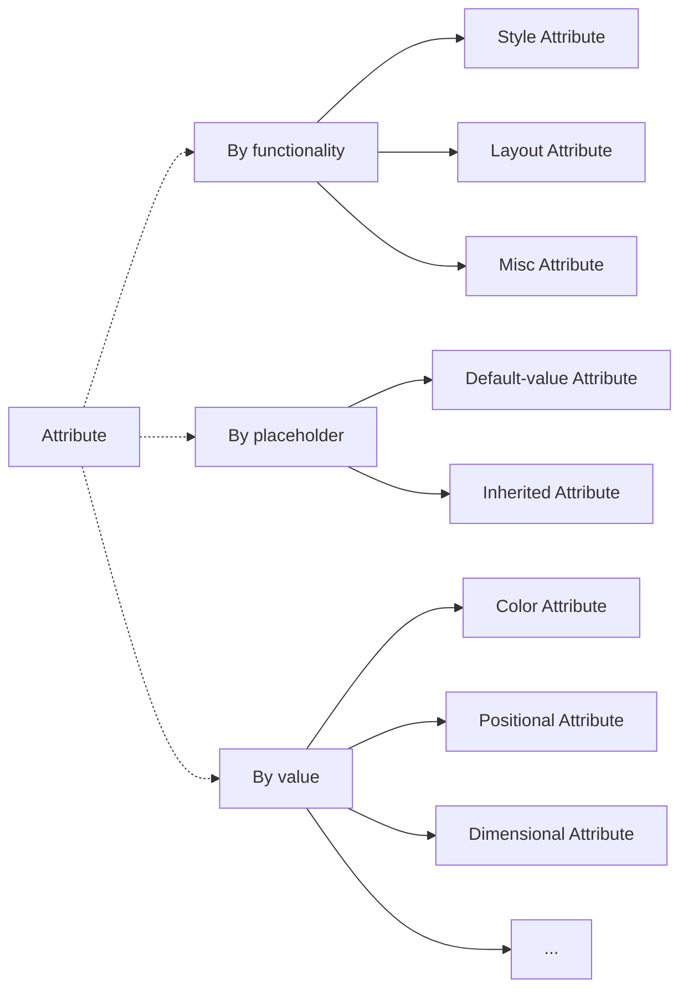
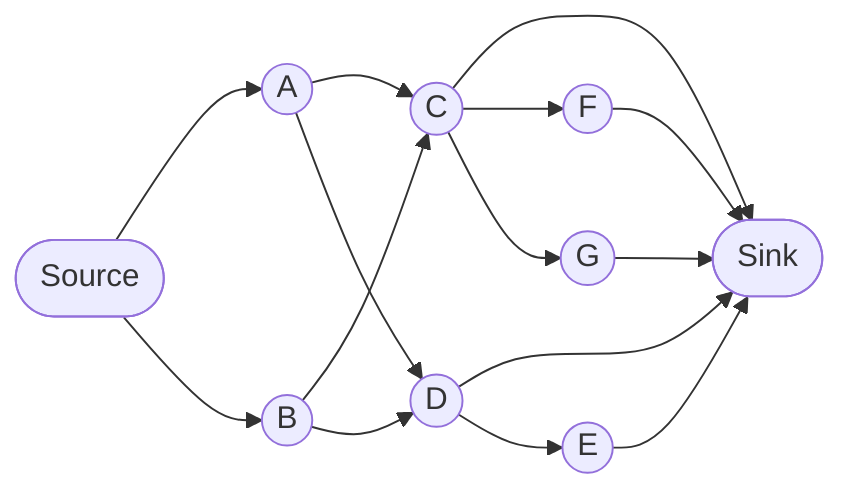
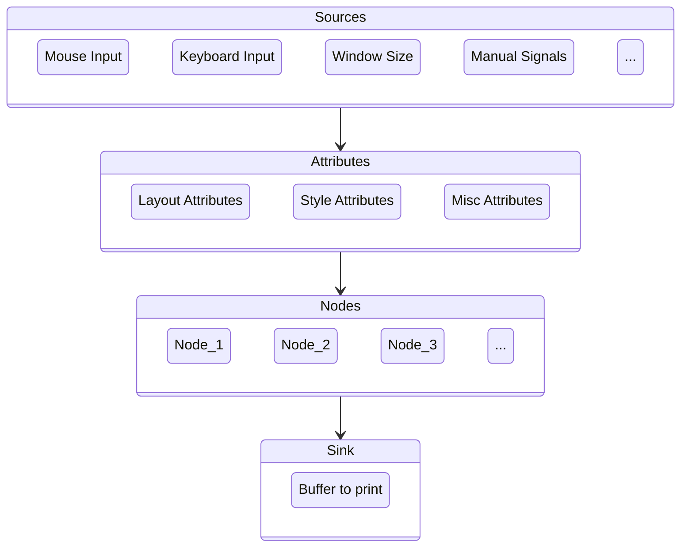

# 2 Program

A ICmd program or application is made up with _nodes_. Each node has attributes.

## 2.1 Node

### 2.1.1 Terminology
> When we say _node_ we think of a tree, but the implementation of ICmd does not rely on a tree structure. Node is just an intimate address acceptable to front end developers.

Node is the minimal complete unit in ICmd render framework.

### 2.1.2 Explanation
Similar to XML nodes, ICmd program is basically the visualization of _nodes_. A node can have the following natures:
- **Node can have attributes which stylize and arrange the the node.** If you have ever developed websites, you are familiar with CSS and HTML attributes. And attributes in ICmd do the same job.
- **Node is dependent.** As one of the highlights in ICmd, dependency means what a node behaves depends on other nodes. Every attribute of a node is relative to that of another one. Based on this, we hold the following statements:
    - **There is only one node as a pivot which does not depend on any other nodes.** In ICmd, the pivot node is the console window. Any other nodes depend on it directly or indirectly.
    - **Inheritance, which defines parent nodes and subnodes, is just a fixed set of dependent relations**. Fundamentally, there is no concept on subnodes or parent nodes in ICmd's design. Since every attribute is relative, it is not necessary to formally hold nodes as a tree. We can achieve subnodes by creating them with a fixed set of attributes that depend on their parent nodes.
- **Node is responsive.** Dependency of a node is kept throughout the runtime if there is no manual intervention. The relativity of nodes is maintained every moment by introducing responsive framework. With this method, it's easy to implement flexible layouts.

## 2.2 - Attribute
Attribute determines how a node layouts and looks like. It can be sorted in different ways.

> *Why do we categorize attributes?* In the design pattern of ICmd, arguments are restricted as strictly as possible. For example, the left margin can only be a horizontal positional value and therefore vertical ones can't be matched although they are both numbers. As we can see, it is beyond checking types. In Rust, we can easily achieve this by using *trait*.

### 2.2.1 By Functionality
We can divide all attributes into style, layout and misc attribute. In implementation, they are the super traits to any other attribute traits.
- **Style Attributes**: Define what a node looks like, such as background color, font size, and border style.
- **Layout Attributes**: Define how a node is arranged, such as margin, padding, and size.

Style attributes play a role in the drawing session of the program. Every node is drawn according to its style attributes. Layout attributes take effect in the layout session. Every measure of the node especially locations of vertices is determined with its layout attributes.

### 2.2.2 By Placeholder

In default, it is exhausting to set all the attributes of a node. We tend to customize a small part of them. Therefore, we have to define behaviors for the unset attributes with placeholders.

- **Default-value Attributes**: Unset attributes are set with the default value of the type. For example, if the type is integer, the default value will be zero. It is the easiest approach to define placeholders.
- **Inherited Attributes**: Unset attributes are dependent values on the attributes from another node. For example, we may have created a box node with a custom font and want to apply it to all the "subnodes". Then with ideas of inherited attributes, we can create "subnodes" from the box node. It is an easy way to generalize attributes and achieve _themes_.

### 2.2.3 By Value

It's intuitive to say that a integer that denotes color cannot be a margin attribute. So we have to further refine and restrict types with traits. For example, we can define a trait for color attributes which is implemented by integers, and when an integer is downcast to a color attribute, it cannot be converted to any other attribute like margin and padding.  

By this idea, we can subdivide attributes into a variety. and they may have inheritance such as positional attribute and horizontal positional attribute. This approach can minimize unexpected arguments found in attribute settings.

## 2.3 Dependency

When a value depends on another one, the instantiation and changing is determined by the value it depends. We call a value varying along another one or several values a _signal_.

### 2.3.1 Design Pattern

In a responsive system, every signal forms a unilateral connected digraph where _source signals_ don't depend on any signals and _sink signals_ are not depended on by any signals. Once a signal changed, the signal directly or indirectly depending on it is changed in a chain reaction. In ICmd, source signals can be mouse and keyboard inputs and network listeners, and sink signals are always character printing since it is a TUI framework.

<i> A signal graph with one source and one sink</i>

 

Except manual signal dependency, we can conclude principal dependencies according to the hierarchical structure of the framework. An example signal chain is like: Mouse clicks --> Background color changes --> The node changes --> Buffer to print changes.

<i> A signal graph that depicts principal dependencies</i>

### 2.3.2 Layout Relativity
ICmd does not use _margin_ and _size_ to define the external layout attributes. Instead, it uses measures on edges.

| Annotation  | Definition |
| ------------- | ------------- |
| $l$  | Left margin of the left edge  |
| $t$  | Top margin of the top edge  |
| $r$  | Left margin of the right edge  |
| $b$  | Top margin of the bottom edge  |

<picture>
  <source media="(prefers-color-scheme: dark)" srcset="assets/2.2.1_dark.png">
  <source media="(prefers-color-scheme: light)" srcset="assets/2.2.1_light.png">
  
</picture>

One major reason to adopt this way is that it is intuitive to make layouts relative. For example, if we want to achieve a horizontal linear layout, we can just let every pair of adjacent node aligned by one's right edge and another one's left edge.

### 2.3.3 Attribute Relativity

When relativity effects on not only layout attributes but ones on something else, it shows divine flexibility and scalability. Some practical usages are as follows.
- Themes are nodes with a bunch of preset attributes for other nodes to depend on.
- Callbacks are attributes who depend on external signals with effect
- Animations are attributes who depend on a counter varying with time.
- ...