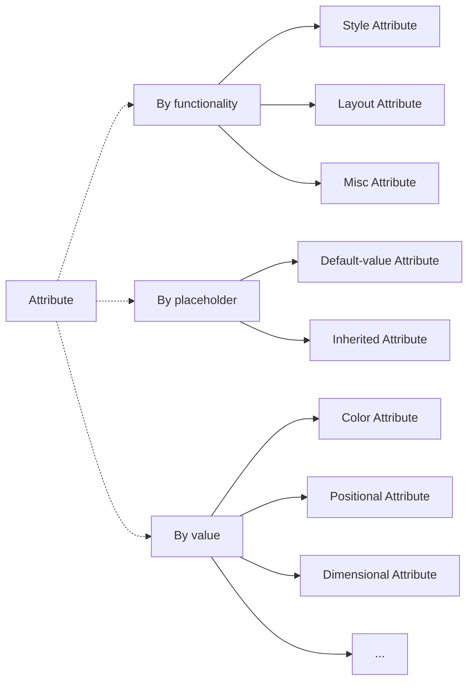
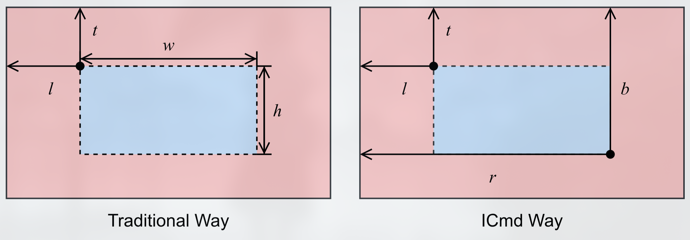

# 2 - Program

A ICmd program or application is made up with _nodes_. Each node has properties.

## 2.1 Node

### 2.1.1 Terminology
> When we say _node_ we think of a tree, but the implementation of ICmd does not rely on a tree structure. Node is just an intimate address acceptable to front end developers.

Node is the minimal complete unit in ICmd render framework.

### 2.1.2 Explanation
Similar to XML nodes, ICmd program is basically the visualization of _nodes_. A node can have the following natures:
- **Node can have properties which stylize and arrange the the node.** If you have ever developed websites, you are familiar with CSS and HTML attributes. And properties in ICmd do the same job.
- **Node is dependent.** As one of the highlights in ICmd, dependency means what a node behaves depends on other nodes. Every attribute of a node is relative to that of another one. Based on this, we hold the following statements:
    - **There is only one node as a pivot which does not depend on any other nodes.** In ICmd, the pivot node is the console window. Any other nodes depend on it directly or indirectly.
    - **Inheritance, which defines parent nodes and subnodes, is just a fixed set of dependent relations**. Fundamentally, there is no concept on subnodes or parent nodes in ICmd's design. Since every attribute is relative, it is not necessary to formally hold nodes as a tree. We can achieve subnodes by creating them with a fixed set of properties that depend on their parent nodes.
- **Node is responsive.** Dependency of a node is kept throughout the runtime if there is no manual intervention. The relativity of nodes is maintained every moment by introducing responsive framework. With this method, it's easy to implement flexible layouts.

## 2.2 Attribute
Attribute determines how a node layouts and looks like. It can be sorted in different ways.

> *Why do we categorize attributes?* In the design pattern of ICmd, arguments are restricted as strictly as possible. For example, the left margin can only be a horizontal positional value and therefore vertical ones can't be matched although they are both numbers. As we can see, it is beyond checking types. In Rust, we can easily achieve this by using *trait*.

### 2.2.1 By Functionality
We can divide all attributes into style, layout and misc attribute. In implementation, they are the super traits to any other attribute traits.
- **Style Attributes**: Define what a node looks like, such as background color, font size, and border style.
- **Layout Attributes**: Define how a node is arranged, such as margin, padding, and size.

ICmd does not use _margin_ and _size_ to define the external layout properties. Instead, it uses measures on edges.

| Annotation  | Definition |
| ------------- | ------------- |
| $l$  | Left margin of the left edge  |
| $t$  | Top margin of the top edge  |
| $r$  | Left margin of the right edge  |
| $b$  | Top margin of the bottom edge  |

   
One major reason to adopt this way is that it is intuitive to make layouts relative. For example, if we want to achieve a horizontal linear layout, we can just let every pair of adjacent node aligned by one's right edge and another one's left edge.