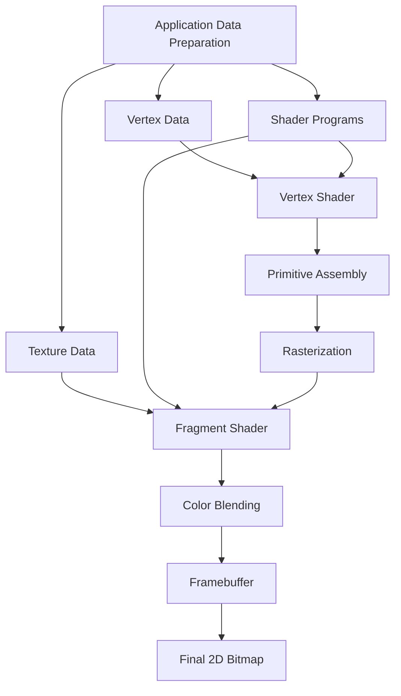

# 3 Renderer
In ICmd, renderer converts nodes into raw text.

## 3.1 Principles

Renderer is the key part of a TUI framework and its optimization as a component that frequently outputs large buffer. ICmd designs a renderer with as little overhead as possible. The principles are as follows:

### Render when Necessary
Rendering is not a coherent process with fps in ICmd. Instead, thanks to the responsive framework, we can render specific parts only when they update. For example, when there is no external signal, the program will actually be static, so the renderer won't opt to run any update onto the console. Instead, if there is a click on a node which changes its background color into green, the renderer will receive the signal and perform updates. This technique eliminates a majority of trivial updates and greatly improves the overall performance.

### Never Print Extra things
Escape codes can stylize the output characters. So we can always print colorful texts onto the terminal. ICmd uses some technique to insert minimal escape codes and necessary characters while keeping the visual effect.

Escape codes can also control where to print. So temporally we compare the frame to be rendered with the last one and only update with difference. It is a more intuitive way that we can know which node is being rendered, precisely and subtly calculate where there is difference, and perform partial updates.

## 3.2 Definitions

### 3.2.1 Basics

**Text pixel** is a string with only one non-escape character.
That is to say it can only be printed as one single character probably with styles decided with escape codes.

**Renderer** can be represented as a function that maps an arbitrary *instruction* to an array of text pixels. Canonically, a renderer
- Listens asynchronously for instructions from *the upper layer* of the framework.
- Processes concurrently with pipeline technique.

**Instruction** is the only input of the renderer. It is an enumeration structure over different types of instructions.

| Types    | Fields | Explanation |
| -------- | ------- | ---------- |
| Initialize | Configurations; Parent Viewport | Initialize the renderer |
| Resize | Measures | Resize renderer's output |
| Create | Node ID; Vertices; Shaders | Render the node |
| Clear | Node ID | Clear the node |
| Transform | Node ID; Matrix | Transform the node |
| Specify | Node ID; Shaders | Update the shader of the node |

### 3.2.2 Configurations

| Attr    | Fields | Explanation |
| -------- | ------- | ---------- |
| Primitives | Points; Lines; Triangles; Polygons| Specify the primitives to be rendered |
| VertexArray | array | Specify the vertex data, in a two-dimensional array format, with each vertex consisting of two ints |
| length | int | Specify the length of the coordinate space |
| width | int | Specify the width of the coordinate space |

### 3.2.3 Shaders

| Attr    | Fields | Explanation |
| -------- | ------- | ---------- |
| ShaderFunc | func| Specify the shader function to be used, a map from Bitmap to string |
| MapFunc | func | Calculate the length and width of the array before and after mapping to calculate the actual bitmap size required |

## 3.3 Implementation

### 3.2.1 how to get the 2D Frame(Gen by LLM)

#### **1. Data Preparation Phase**

- **Vertex Data**: 2D coordinates (Normalized)
- **Texture Data(Optional)**: 2D bitmap stored using an RGB matrix
- **Shader Programs(Optional)**: Vertex and fragment shaders

#### **2. Vertex Processing Phase**

- **Vertex Shader**: Transforms vertex positions, handles 2D transformations
- **Primitive Assembly**: Assembles vertices into points, lines, triangles
- **Rasterization**: Converts primitives into pixel fragments

#### **3. Fragment Processing Phase**

- **Fragment Shader**: Calculates color for each fragment, applies texture sampling
- **Color Blending**: Handles transparency and blending operations

#### **4. Output Phase**

- **Framebuffer**: Destination for rendered output
- **Final 2D Bitmap**: Displayed result

### 3.2.2 Fxxk DexerMatter and transform the Bitmap to Escape Code(Gen by LLM)

<picture>
  
</picture>

#### **1. Data**

- **EBO**: Element Buffer Object, stores indices that define the order of vertex rendering
- **VBO**: Stores vertex data, including positions, texture coordinates, and colors

#### **2. Rasteration**

- **Primitive Assembly**: Assembles vertices into primitives (points, lines, triangles, polygons)
- **Fragment Shader**: Calculates color for each fragment
- **Rasteration**: Converts primitives into pixel fragments
- **Bitmap**: Stores the rendered pixel data, with each pixel having a color value

#### **3. Escaping**

- **Shader**: Convert the bitmap to a string of text pixels
- **Clip**: Clip the rendered bitmap to the viewport
- **String**: text pixels for the frame

#### **4. Blending**

- **Request Queue**: Stores the blending requests, each containing the node ID, the text pixels, and the blending position
- **Async Update**: Asynchronously update the frame with the blending requests
- **Incremental Update**: Only update the changed parts of the frame, rather than the whole frame
- **Blending**: Test mixing the text of each node.

#### **5. User**

- **Frame Buffer**: Stores the final frame buffer, which is the output of the renderer
- **Terminal Output**: Displays the frame buffer on the terminal
