# 3 - Renderer
In ICmd, renderer converts nodes into raw text.

## 3.1 - Principles

Renderer is the key part of a TUI framework and its optimization as a component that frequently outputs large buffer. ICmd designs a renderer with as little overhead as possible. The principles are as follows:

### Render when Necessary
Rendering is not a coherent process with fps in ICmd. Instead, thanks to the responsive framework, we can render specific parts only when they update. For example, when there is no external signal, the program will actually be static, so the renderer won't opt to run any update onto the console. Instead, if there is a click on a node which changes its background color into green, the renderer will receive the signal and perform updates. This technique eliminates a majority of trivial updates and greatly improves the overall performance.

### Never Print Extra things
Escape codes can stylize the output characters. So we can always print colorful texts onto the terminal. ICmd uses some technique to insert minimal escape codes and necessary characters while keeping the visual effect.

Escape codes can also control where to print. So temporally we compare the frame to be rendered with the last one and only update with difference. It is a more intuitive way that we can know which node is being rendered, precisely and subtly calculate where there is difference, and perform partial updates.

## 3.2 - Implementation

### 3.2.1 - how to get the 2D Frame(Gen by LLM)

```mermaid
graph TD
    A[Application Data Preparation] --> B[Vertex Data]
    A --> C[Texture Data]
    A --> D[Shader Programs]
    
    B --> E[Vertex Shader]
    E --> F[Primitive Assembly]
    F --> G[Rasterization]
    
    C --> H[Fragment Shader]
    D --> E
    D --> H
    
    G --> H
    H --> K[Color Blending]
    K --> L[Framebuffer]
    L --> M[Final 2D Bitmap]
```

#### **1. Data Preparation Phase**

- **Vertex Data**: 2D coordinates (Normalized)
- **Texture Data(Optional)**: 2D bitmap stored using an RGB matrix
- **Shader Programs(Optional)**: Vertex and fragment shaders

#### **2. Vertex Processing Phase**

- **Vertex Shader**: Transforms vertex positions, handles 2D transformations
- **Primitive Assembly**: Assembles vertices into points, lines, triangles
- **Rasterization**: Converts primitives into pixel fragments

#### **3. Fragment Processing Phase**

- **Fragment Shader**: Calculates color for each fragment, applies texture sampling
- **Color Blending**: Handles transparency and blending operations

#### **4. Output Phase**

- **Framebuffer**: Destination for rendered output
- **Final 2D Bitmap**: Displayed result

### 3.2.2 - Fxxk DexerMatter and transform the Bitmap to Escape Code(Gen by LLM)

#### **1. Signal Processing Phase**

- **Signal Update**: Receives signals from the responsive system (mouse, keyboard, window resize, etc.)
- **Node Tree Update**: Updates affected nodes based on signal dependencies and attribute relativity

#### **2. Layout Phase**

- **Layout Calculation**: Computes node positions using edge-based layout system (l, t, r, b)
- **Coordinate Transformation**: Converts relative coordinates to absolute terminal positions

#### **3. Rendering Phase**

- **Inheritance Resolution**: Resolves inherited attributes from parent nodes
- **Style Application**: Apply style attributes (color, border, font) to nodes and convert them into textures, vertex and shader properties, then deliver them to the renderer. **Text will not be rendered as a bitmap, but will directly participate in Node Blend Stage.**
- **Rendering**: Preparing the node data and get the 2D bitmap matrix. 
- **Node Blend Stage**: Test mixing the bitmap with the text of each node.
- **Escape Code Generation**: Generates minimal ANSI escape codes from the bitmap.
- **Buffer Diff Calculation**: Compares current frame with previous frame to find differences
- **Terminal Output**: Outputs only the changed portions to the terminal

